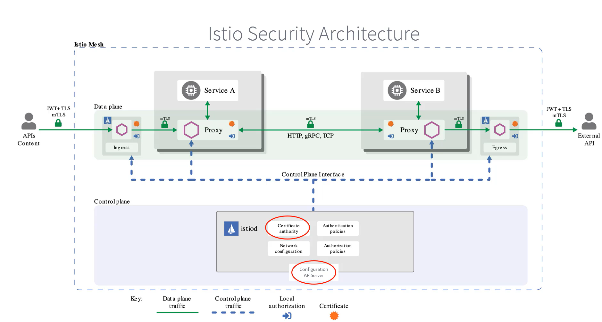

# Istio Exercise
1. Download Istio contents using below commands and set the path in bin:
```console
curl -L https://istio.io/downloadIstio | sh -
export PATH=$PWD/bin:$PATH
```
2. Install Istio using istioctl:
```console
istioctl install --set profile=demo -y
```
3. We will need to change the ingressgateway service type from LoadBalancer to NodePort:
```console
kubectl patch svc istio-ingressgateway -n istio-system -p '{"spec": {"type": "NodePort"}}'
```
#### For this exercise we will consider example of bookinfo app. The details are below:
The application displays information about a book, similar to a single catalog entry of an online book store. Displayed on the page is a description of the book, book details (ISBN, number of pages, and so on), and a few book reviews.

#### The Bookinfo application is broken into four separate microservices:

- Productpage: The productpage microservice calls the details and reviews microservices to populate the page.
- Details: The details microservice contains book information.
- Reviews: The reviews microservice contains book reviews. It also calls the ratings microservice.
- Ratings: The ratings microservice contains book ranking information that accompanies a book review.


There are 3 versions of the reviews microservice:
- Version v1 doesn’t call the ratings service.
- Version v2 calls the ratings service, and displays each rating as 1 to 5 black stars.
- Version v3 calls the ratings service, and displays each rating as 1 to 5 red stars.

4. Create a new namespace 
```console
kubectl create ns bookinfo
```
5. Enable the namespace for Istio injection. It  will deploy Envoy proxy as a sidecar container in all the pods of the namespace
```console
kubectl label namespace bookinfo istio-injection=enabled
```
6. Analyze the namespace
```console
istioctl analyze -n bookinfo
```
7. Deploy the bookinfo app
```console
kubectl apply -f bookinfo/bookinfo.yaml -n bookinfo
```
8. To confirm that the Bookinfo application is running, send a request to it by a curl command from some pod, for example from ratings:
```console
kubectl exec <ratings-pod-name> -n bookinfo -c ratings -- curl -sS productpage:9080/productpage | grep -o "<title>.*</title>"
```
#### Now that the Bookinfo services are up and running, we need to make the application accessible from outside of our Kubernetes cluster, e.g., from a browser. A gateway is used for this purpose.
##### Istio Gateway Controller is an advanced substitute of Ingress Controller used in Kubernetes. It is deployed as ingress and egress. In Istio, a Gateway defines how traffic is allowed to enter or leave the service mesh. It controls access to services running inside the mesh and is primarily used for managing ingress (incoming) and egress (outgoing) traffic to and from the mesh. While Kubernetes has its own Ingress resource, Istio’s Gateway gives more fine-grained control over the routing, particularly when combined with Istio’s VirtualService resource.

#### Once a Gateway is defined, a VirtualService is used to define rules on how to route the incoming traffic to the appropriate service inside the mesh.

9. We will be creating a gateway object and a virtual service:
```console
kubectl apply -f bookinfo/bookinfo-gateway-vs.yaml -n bookinfo
```
10. Confirm the gateway has been created:
```console
kubectl get gateway
```
11. To confirm that the Bookinfo application is accessible from outside the cluster, run the following curl command:
```console
export GATEWAY_URL=<node IP or host name>:<node-port>
curl -s "http://${GATEWAY_URL}/productpage" | grep -o "<title>.*</title>"
```
12. Deploy Kiali & Prometheus using command below
```console
kubectl apply -f addons/kiali.yaml -n istio-system
kubectl apply -f addons/prometheus.yaml -n istio-system
```

13. Try to open the UI of Kiali on Node port 30007 or we can also fire the command below:
```console
istioctl dashboard kiali
```
14. Now lets generate some traffic on bookinfo application for testing:
```console
while sleep 0.01; do curl -sS "http://${GATEWAY_URL}/productpage" &> /dev/null ; done
```


##### Destination Rules are used to configure policies that apply to traffic intended for a particular service after it has been routed by a VirtualService. They provide control over things like load balancing, connection pool settings, circuit breaking, and subsets of the service (which allow fine-grained control over different versions or subsets of the service).
##### A subset within a Destination Rule represents a group of service instances that are differentiated based on specific labels (e.g., different versions of a service). Subsets are commonly used for traffic splitting, canary deployments, or A/B testing, where traffic is directed to specific versions of a service based on criteria defined in the VirtualService.

15. Our requirement is to send to 60% of traffic to reviews v1 and remaining 20-20 to v2 and v3. For this we will create a virtual service and a destination rule with 60-20-20 weights to their respective subsets. USe the below commands to create them:
```console
kubectl apply -f bookinfo/destination-rule.yaml -n bookinfo
kubectl apply -f bookinfo/virtual-service-reviews-60-20-20.yaml -n bookinfo
```
#### Now we can see the traffic distribution on Kiali Dashboard

16. Next we would introduce some errors, to check if the error handling mechanisms are working as expected. This is a testing approach known as fault injection. We can inject errors in our virtual service which could be error or delay. In this example we will add a delay of 5 seconds in details service to 70% of requests:
```console
kubectl apply -f bookinfo/fault-injection-details.yaml -n bookinfo
```
#### You can see in the image below that there is a red line showing 4.8 secs of delay for details service


#### You can configure timeouts, retries and circuit breaking through Istio. This way we don't have to handle these problems in application code.
Since the services are dependent on each other, slowness on one service might affect the other services dependent on it and even have a cascading effect.
If a service is taking too much time to respond it must not keep the dependent services waiting for it forever and it must fail after a period of time and return an error message. This is why we configure timeout.

We can add timeout value in the destination section of a virtual service.
Similarly we can specify retries it should make before throwing an error within a virtual service.

```yaml
retries:
  attempts: 3
  perTryTimeout: 2s
```
To prevent our services from going going down, when they are under high load we can configure Circuit Breaking
For this we need to define a traffic policy in our destination rule like below:
```yaml
trafficPolicy:
  connectionPool:
    tcp:
      maxConnections: 3
```
### Istio Security


### Some of the security features of Istio
1: Service-to-Service Encryption
- Istio provides mutual TLS (mTLS) to ensure secure communication between microservices. With mTLS, both the client and the server authenticate each other, and the communication is encrypted.
- Istio can automatically manage TLS certificates for services within the mesh, handle certificate rotation, and manage secure communication without changes to application code.

2: Authentication
- Istio supports JWT (JSON Web Token) authentication to verify the identity of users or services. It ensures that only valid users or services can interact with the microservices.

3: Authorization
- Istio implements Role-Based Access Control (RBAC) policies to control which users or services can access specific resources.

Lets checkout a PeerAuthentication Policy
The policy is enabled for entire demo-app namespace and all workloads under demo-app namespace must strictly use mutual TLS.
```yaml
apiVersion: security.istio.io/v1beta1
kind: PeerAuthentication
metadata:
  name: demo-peer-policy
  namespace: demo-app
spec:
  mtls:
    mode: STRICT
```
To make it a mesh-wide policy we should change the namespace value to **istio-system**

Lets checkout an AuthorizationPolicy
The policy allows all GET requests from demo-app namespace to demo-api namespace.

```yaml
apiVersion: security.istio.io/v1beta1
kind: AuthorizationPolicy
metadata:
  name: demo-api-policy
  namespace: demo-api
spec:
  action: ALLOW
  rules:
  - from:
    - source:
        namespaces: ["demo-app"]
    to:
    - operation:
        methods: ["GET"]
```
We have now configured an authorization policy to allow all GET requests from the demo-app namespace to the demo-api namespace. This means that any GET requests from any other namespace like default will be rejected.

#### Istio exposes a lot of metrics on Prometheus, you can try using sample Grafana dashboards provided by Istio

#### Use the below command to delete the sample app bookinfo and all its resources
```console
kubectl delete -f bookinfo/ -n bookinfo
kubectl delete ns bookinfo
```
#### If you find any mistakes or scope of improvement, please reach out to me at amadaan7@gmail.com
Follow me on LinkedIn: https://www.linkedin.com/in/arpitmadaan/

Follow me on Medium: https://medium.com/@amadaan7